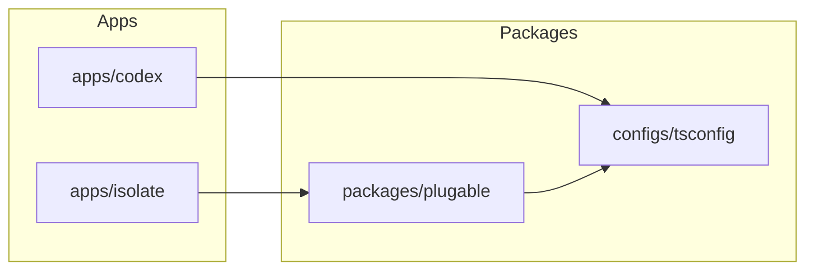
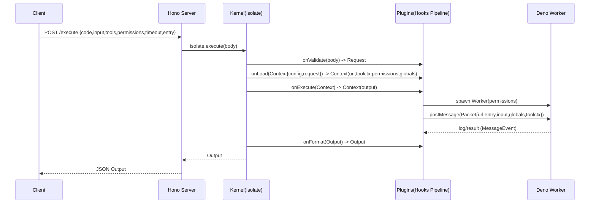

# 项目架构总览与评估（OpenCode）

## 1. 范围与目标

本文件覆盖本仓库当前形态的整体架构（monorepo 维度），并对关键架构缺陷/风险点做分级评估与改进建议。细节使用指南请参考各子项目的 README。

## 2. 仓库结构（宏观）

```
opencode/
  apps/
    codex/          # Vue 3 前端
    isolate/        # Deno 安全沙箱执行引擎
  packages/
    plugable/       # 通用插件系统
  configs/
    tsconfig/       # TS 配置预设
```

### 2.1 依赖关系（逻辑）



## 3. 技术栈与运行方式（事实描述）

- Monorepo：pnpm workspace + Turborepo（根目录 `dev/build` 通过 turbo 分发）
- `apps/codex`：Vue 3 / Pinia / Vue Router / Vite / Tailwind
- `apps/isolate`：Deno（开启 `worker-options` unstable）+ Hono（HTTP）+ Deno Worker 沙箱
- `packages/plugable`：纯 TypeScript 库（零运行时依赖）

## 4. 核心应用：Isolate（沙箱执行引擎）

### 4.1 入口与对外接口

- HTTP 服务入口：[server.ts](../apps/isolate/src/server.ts)
  - `POST /execute`：接收执行请求，调用 `kernel.execute()` 返回 `Output`
  - `GET /health`：健康检查
- 内核入口：[create](../apps/isolate/src/kernel.ts)
  - 通过插件系统组装 hooks：`onValidate` → `onLoad` → `onExecute` → `onFormat`

### 4.2 内核执行链路（数据流）



### 4.3 插件架构（组装方式）

Isolate 依赖 [@opencode/plugable](../packages/plugable/src/manager.ts) 的 Manager + Hook/Pipeline，将执行流程拆成可组合插件：

- [kernel.ts](../apps/isolate/src/kernel.ts) 里默认注册插件（按 sort 的拓扑结果初始化，并在 setup 时向 hooks tap 中间件）
- 插件通过 hooks 做扩展点：
  - `onValidate`：输入校验
  - `onLoad`：准备执行上下文（URL、工具选择、权限合并、全局注入变量等）
  - `onSpawn`：Worker 生成后，可挂载 RPC、Channel 等
  - `onExecute`：真正执行（通常触发 worker + 运行器）
  - `onFormat`：输出整形（例如日志裁剪）

默认插件（现状）：

- Guard：[guard.ts](../apps/isolate/src/plugins/guard.ts)（请求结构/大小/timeout）
- Toolset：[toolset.ts](../apps/isolate/src/plugins/toolset.ts)（解析 `tools` 选择、工具上下文）
- Loader：[loader.ts](../apps/isolate/src/plugins/loader.ts)（把代码编码成 data URL）
- Permission：[permission.ts](../apps/isolate/src/plugins/permission.ts)（合并请求权限与工具权限、环境变量白名单与注入）
- Sandbox：[sandbox/index.ts](../apps/isolate/src/plugins/sandbox/index.ts)（spawn worker + 执行器）
- Database：[database/index.ts](../apps/isolate/src/plugins/database/index.ts)（Host RPC + 连接池）
- Channel：[channel.ts](../apps/isolate/src/plugins/channel.ts)（Worker 间广播通道）
- Logger：[logger.ts](../apps/isolate/src/plugins/logger.ts)（格式化阶段裁剪日志）

### 4.4 Worker 沙箱模型（关键安全边界）

Worker 入口：[worker.ts](../apps/isolate/src/worker.ts)

- 执行模式：
  - 每次执行会创建一个 Deno Worker（`namespace: false`，权限来自合并后的 `Deno.PermissionOptions`）
  - 主线程把用户代码编码成 `data:application/javascript;base64,...` 并通过 `import(url)` 加载
  - 通过 `entry` 指定导出函数作为入口（默认 `default`）
- 工具系统：
  - Worker 侧基于工具 registry 构建工具集合并注入 `globalThis`
  - [common/tools.ts](../apps/isolate/src/common/tools.ts) + [common/inject.ts](../apps/isolate/src/common/inject.ts) 负责注入与跟踪
- 通信：
  - 主线程 [bridge.ts](../apps/isolate/src/bridge.ts) 负责日志收集与结果等待
  - Host/Client RPC：[common/rpc.ts](../apps/isolate/src/common/rpc.ts)，用于把“受控能力”（如 DB）从主线程暴露给 worker

## 5. 前端应用：Codex（Vue）

当前 `apps/codex` 更接近脚手架/原型状态：

- 入口：[main.ts](../apps/codex/src/main.ts)（createApp + router + pinia）
- 页面：[Home.vue](../apps/codex/src/pages/Home.vue)

推荐将 Codex 与 Isolate 的交互收敛为：

- 一个明确的 API client（例如 `apps/codex/src/api/isolate.ts`），封装 `/execute` 的请求/响应类型
- 一个“执行任务模型”（requestId、timeout、日志展示、重试策略、错误分类）

## 6. 共享基础设施

### 6.1 Plugable（插件系统）

- 管理器：[createManager](../packages/plugable/src/manager.ts)
- 排序：[sort](../packages/plugable/src/sort.ts)（Kahn 拓扑排序）
- Hook/Pipeline：[hook.ts](../packages/plugable/src/hook.ts)

Isolate 的“内核插件化”完全基于 plugable：插件在 `setup(api)` 中向 hook tap 中间件，从而形成可扩展的执行管线。

### 6.2 TSConfig 预设

统一 TS 严格度、模块系统、前后端差异配置，详见：[configs/tsconfig/README.md](../configs/tsconfig/README.md)

## 7. 架构缺陷与风险评估（含建议）

下表按影响面与修复收益分级（P0 最高优先级）。

| 优先级 | 位置 | 问题描述 | 影响 | 建议 |
|---|---|---|---|---|
| P0 | plugable | `pre/post` 语义与文档不一致，且命名易误导（实现：`pre` 形成 “依赖先于我” 的边；`post` 形成 “我先于依赖” 的边） | 插件执行顺序容易被误用，导致 hook tap 顺序错误，出现隐蔽行为差异 | 统一语义：修正文档或重命名字段；补充排序单测覆盖典型 case 与循环依赖 |
| P0 | isolate/permissions | `strict` 目前仅 `console.warn`，并不阻止高危权限（如 `env:true`、过多 hosts、localhost） | 安全模型与配置名不一致，容易产生“已严格限制”的误解 | 将 strict 变为“阻断策略”（抛错）或拆分为 `strictWarn/strictEnforce` 两档 |
| P0 | isolate/loader | `btoa(code)` 对非 Latin-1 字符不安全（含中文注释/字符串常见） | 线上随机执行失败（编码异常） | 使用 UTF-8 安全 base64 编码（TextEncoder → base64）替代 |
| P1 | isolate/server | `/execute` 的去重逻辑是“1 秒窗口同 payload 拒绝”，不是实际限流；缓存上限与清理策略可能被滥用 | 容易被绕过或造成内存压力，且语义可能与调用方预期不一致 | 引入按 IP/API Key 的速率限制与队列；将去重作为可选特性并明确返回码语义 |
| P1 | isolate/database | Pool 生命周期与服务关闭未绑定（interval 不释放、无显式 dispose），事务超时固定 30s | 资源泄漏与不可控的连接行为，长时间运行风险上升 | 增加插件生命周期（init/dispose）或在 server shutdown 钩子里调用 `pool.destroy()` |
| P1 | isolate/worker | 每次执行创建并销毁 Worker，隔离强但开销大；在高并发下会放大 CPU/内存抖动 | 性能与成本风险 | 提供可配置的 worker 复用/池化模式，并加上每 worker 的“执行隔离”策略 |
| P2 | isolate/common/inject | `inject` 默认 `configurable:false`，`reset` 只删除可配置属性（目前主要靠“执行后 kill worker”避免污染） | 一旦未来引入 worker 复用，会出现全局污染与不可清理状态 | 若引入复用：调整注入策略（可配置删除/租户隔离）并配套强制 reset |
| P2 | 文档体系 | 根目录缺少统一入口，isolate README 过大且不利于维护检索 | 新人理解成本高，变更难同步 | 建立 docs 目录的索引与分层：总览 → 模块 → 细节；将 isolate README 拆分为多文档（可选） |

## 8. 建议的架构收敛方向（不改现状的前提下）

- 明确三层边界：`HTTP API(transport)` / `Kernel(业务管线)` / `Sandbox(执行隔离)`，并为每层提供最小、稳定的接口类型
- 把安全策略“可验证”：将 strict 政策做成可测试的规则集合，提供一组基准用例（wildcard、localhost、env 白名单等）
- 把扩展点“可演进”：对 plugable 的排序语义做稳定化（文档/测试/命名三者一致），减少未来插件迭代风险
