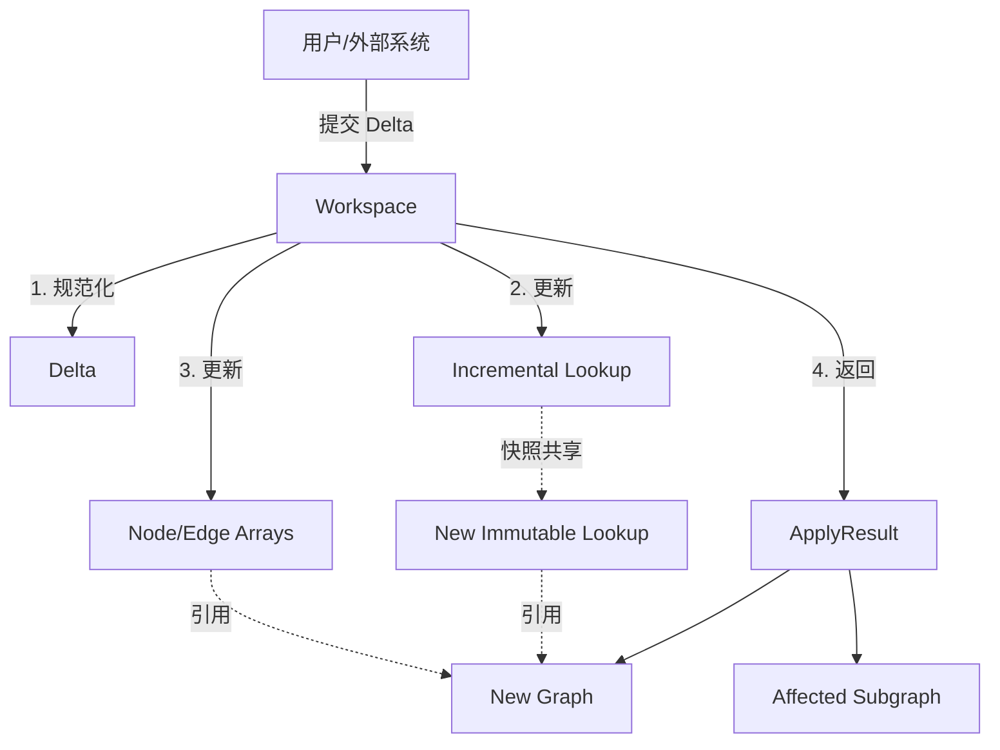

# Graph 引擎架构分析与设计方案

## 1. 概述

`@opencode/graph` 是一个高性能、可扩展的内存图（Graph）引擎，专为支持复杂的图编辑场景（如流程编排、数据血缘分析、可视化建模）而设计。

它采用了**微内核架构**，将核心数据模型（Model）、索引查询（Lookup）、编辑会话（Workspace）与校验逻辑（Validate）解耦，实现了高内聚低耦合的设计目标。

## 2. 核心架构原则

1.  **不可变性 (Immutability)**
    *   核心图模型 (`Graph`, `Node`, `Edge`) 均为不可变对象。
    *   任何变更都会生成新的对象实例，而非修改现有对象。这确保了数据的安全性，天然支持撤销/重做（Undo/Redo）栈，并简化了并发处理。

2.  **读写分离 (Segregation of Responsibilities)**
    *   **读**：通过 `Lookup` 接口提供 O(1) 的高性能查询。
    *   **写**：通过 `GraphWorkspace` 和 `GraphDelta` 管理变更事务。

3.  **增量更新 (Incremental Updates)**
    *   为了解决不可变模型在大规模图编辑时的性能瓶颈，引入了 `IncrementalLookup`。
    *   在编辑会话中，索引是增量维护的，避免了每次微小变更都触发全量索引重建 (O(N) -> O(Δ))。

## 3. 模块详细设计

### 3.1 模型层 (`src/model`)

定义了图的基础数据结构，完全贫血模型，只包含数据和基础存取方法。

*   **Graph**: 图的根对象，包含节点列表、边列表和索引引用。
*   **Node**: 节点，包含输入/输出端点 (`Input`/`Output`)。
*   **Edge**: 边，连接源端点 (`source`) 和目标端点 (`target`)。
*   **Reference**: 弱引用结构，通过 ID (`nodeId`, `endpointId`) 关联对象，便于序列化。

### 3.2 索引层 (`src/lookup`)

解决了“数组遍历查找慢”的问题，将图的遍历复杂度从 O(N) 降低到 O(1)。

*   **Lookup (Immutable)**: 只读索引，用于 `Graph` 实例。构建时计算所有映射关系（ID 映射、邻接表、归属关系）。
*   **IncrementalLookup (Mutable)**: 可变索引，用于 `GraphWorkspace`。支持 `applyDelta` 操作，仅更新受影响的索引项。
*   **LookupSnapshot**: 索引状态的快照数据，用于在 `IncrementalLookup` 和 `Lookup` 之间零拷贝（或浅拷贝）传递状态。

### 3.3 工作区层 (`src/workspace`)

管理图的生命周期和编辑会话。

*   **GraphWorkspace**: 用户交互的主要入口。
    *   持有当前的 `Graph` 快照（不可变）和 `IncrementalLookup`（可变）。
    *   **核心流程 (`apply`)**:
        1.  接收变更描述 (`GraphDelta`)。
        2.  规范化 Delta（例如自动级联删除关联边）。
        3.  更新内部数组和增量索引。
        4.  基于增量索引快照，快速构建新的 `Graph` 实例。
        5.  计算受影响的子图范围。

### 3.4 变更层 (`src/delta`)

定义了图的原子变更操作。

*   **GraphDelta**: 包含 `addedNodes`, `removedNodeIds`, `addedEdges`, `removedEdgeIds`。
*   设计为纯数据结构 (JSON Object)，易于序列化传输和存储。

### 3.5 影响分析层 (`src/subgraph`)

用于分析变更对图的波及范围，支持依赖追踪。

*   **affectedSubgraph**: 基于 BFS 算法，支持向上游（依赖方）或下游（影响方）传播。
*   **ImpactOptions**: 配置传播方向、深度限制、屏障节点等。

### 3.6 校验层 (`src/validate`)

可插拔的规则引擎，用于保障图的逻辑完整性。

*   **validate**: 主入口，执行一系列 `Rule`。
*   **Standard Rules**:
    *   `identity`: ID 唯一性检查。
    *   `reference`: 悬空引用检查（边连接了不存在的节点）。
    *   `direction`: 连接方向检查（Output -> Input）。
    *   `ownership`: 端点归属权检查。
    *   `cardinality`: 端口连接数限制。
    *   `flow`: 数据流类型兼容性检查。

## 4. 数据流转图

## 5. 现状评估与改进计划

### 5.1 代码规范依从性 (已完成)
已按照 `AGENTS.md` 规范完成全量重构：
*   **命名**: 严格遵守“最多2个单词”限制（如 `ImpactOptions`, `standardRules`）。
*   **结构**: 拆分了超长函数（如 `collectAffected`），消除了深层嵌套。
*   **语义**: 将 `Edge` 的 `from/to` 重命名为更明确的 `source/target`。

### 5.2 遗留缺陷与风险
1.  **测试缺失**: 当前工程缺乏单元测试和集成测试，核心算法（尤其是增量索引维护）的稳定性难以保障。
2.  **事件机制**: 缺失 EventEmitter，外部无法订阅图变更事件。
3.  **自动校验**: `Workspace.apply` 默认不执行校验，可能产生非法图状态。
4.  **序列化**: 虽然 `Graph` 可序列化，但 `Workspace` 的会话状态无法持久化。

### 5.3 下一步演进建议
1.  **引入测试框架**: 建立 Jest/Vitest 测试环境，覆盖所有核心路径。
2.  **增强校验**: 在 `GraphWorkspace` 中增加 `autoValidate` 选项。
3.  **实现事务回滚**: 在 `apply` 失败时能够回滚索引状态。
4.  **环路检测**: 增加 Cycle Detection 规则，防止形成非法的循环依赖。
