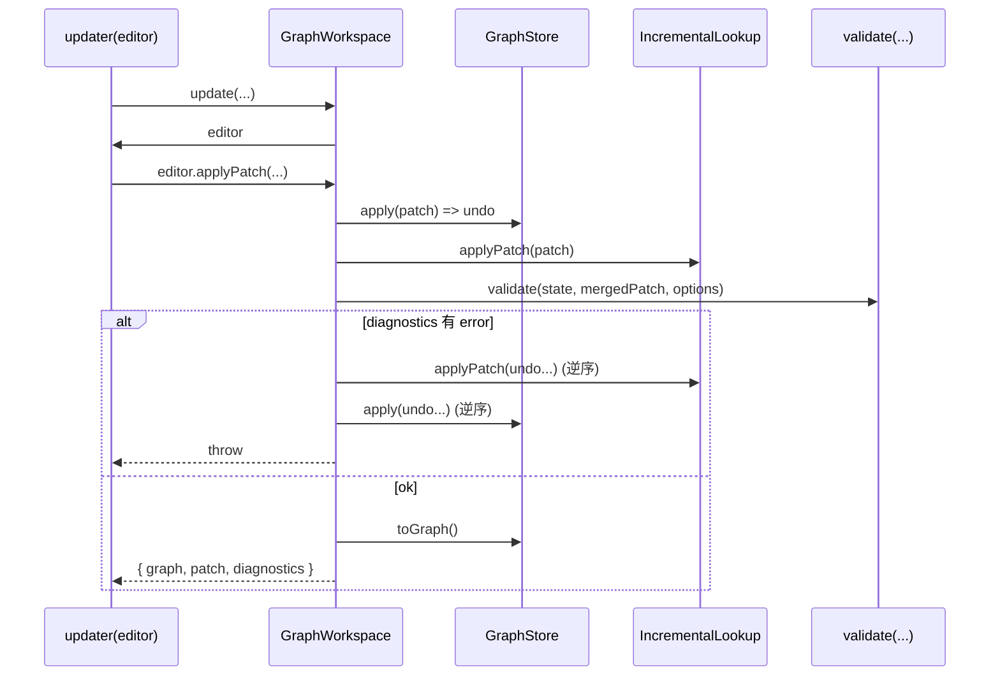

# @opencode/graph 架构说明（架构开发视角）

## 目标与非目标

### 目标

- 提供一套“图结构描述”的通用内核：节点、端点、边、序列化。
- 提供安全的编辑事务：意图操作 -> 事实补丁 -> 校验 -> 提交新快照（失败可回滚）。
- 提供可插拔的结构语义：校验规则、影响传播语义。
- 在编辑与分析场景下保持高性能：读查询 O(1)、增量更新避免全量重建。

### 非目标

- 不负责“执行/调度/运行时”：本包仅验证描述自洽与提供分析结构。
- 不实现领域业务节点类型：`Node.type` 由上层业务定义。
- 不做数据内容校验：`Contract.schema` 只是承载约束定义；本包不解析 schema。

## 边界与层次

本包按“稳定内核 + 可插拔能力”的微内核思路组织：核心层保持小而稳，扩展点以接口/选项注入。

### 模块边界

- **model**：不可变快照模型与序列化（定义“是什么”）。
- **state**：唯一事实源（可变）与补丁应用（定义“怎么变”）。
- **workspace**：事务边界与写入口（定义“变更流程”）。
- **lookup**：读优化索引（定义“怎么查”）。
- **validate**：结构一致性校验（定义“什么是合法描述”）。
- **subgraph**：影响分析与局部视图（定义“变更影响范围”）。
- **utils**：跨模块公共能力（如 ID 生成）。

### 依赖方向（必须遵守）

```mermaid
flowchart TD
  utils[utils] --> model[model]
  model --> state[state]
  model --> lookup[lookup]
  model --> validate[validate]
  model --> subgraph[subgraph]
  model --> workspace[workspace]
  state --> validate
  state --> subgraph
  state --> workspace
  lookup --> workspace
  validate --> workspace
```

约束：

- `model` 不依赖任何上层模块。
- `state` 只依赖 `model`（以及自身类型）。
- `workspace` 是唯一写入口，集中处理事务、回滚、提交快照。
- `validate/subgraph` 在算法层尽量只依赖 `state` 的查询 API（其类型定义仍来自 `model`），避免跨层耦合到 `lookup` 的内部实现。

## 核心概念与不变量

### Graph / GraphSpec：不可变快照契约

- `GraphSpec` 统一 `nodes/edges/metadata` 结构，用于让 `Graph` 与 `Subgraph` 共享算法入口（如查表、遍历、校验）。
  - 参考：[base.ts](file:///e:/opencode/packages/graph/src/model/base.ts#L4-L29)
- `Graph` 是不可变快照：构造时冻结节点与边数组；序列化边界明确。
  - 参考：[graph.ts](file:///e:/opencode/packages/graph/src/model/graph.ts#L36-L88)

不变量：

- `Graph` 实例创建后，其 `nodes/edges` 列表不可被原地修改。

### Node / Endpoint / Contract：结构化连接点

- `Node` 由输入/输出端点构成，端点上承载 `Contract`。
  - 参考：[node.ts](file:///e:/opencode/packages/graph/src/model/node.ts#L53-L131)
- `Endpoint` 是 `Input/Output` 基类，端点用 `Contract(flow, schema?)` 表达“数据交换协议”。
  - 参考：[endpoint.ts](file:///e:/opencode/packages/graph/src/model/endpoint.ts#L45-L85)、[contract.ts](file:///e:/opencode/packages/graph/src/model/contract.ts#L21-L57)

不变量：

- 端点 ID 在图的全局范围内应唯一（校验层与状态层都要求）。
- 端点属于某个节点：`endpointId -> nodeId` 的归属关系是可推导且可查询的。

### Edge / Reference：通过引用连接，避免对象图耦合

- `Edge` 用 `Reference(nodeId, endpointId)` 指向端点，不直接持有端点对象引用。
  - 参考：[edge.ts](file:///e:/opencode/packages/graph/src/model/edge.ts#L44-L105)、[reference.ts](file:///e:/opencode/packages/graph/src/model/reference.ts#L22-L57)

不变量：

- 连接方向默认是 `Output -> Input`（可在校验层约束）。
- 引用完整性：边引用的节点与端点必须存在（可在校验层约束）。

## 稳定内核：事实源、补丁与事务

### Patch：事实变更最小语言

`Patch` 只描述“事实层变更”，不表达意图；意图由更上层的编辑命令表达。

- 参考：[patch.ts](file:///e:/opencode/packages/graph/src/state/patch.ts#L3-L16)

设计约束：

- Patch 必须可组合：多个 patch 在事务里累积后可合并为一个等价 patch。
- Patch 必须可回滚：`apply(patch) -> UndoPatch`，并可再次 `apply(undo)` 撤销。

### GraphStore：唯一事实源（可变）

`GraphStore` 是事实层的“权威存储”，以 `Map` 与邻接表维护实体与关系，并提供：

- 快速查询：`getNode/getEdge/getEndpoint/getNodeIncoming/getNodeOutgoing...`
- 事实应用：`apply(patch)` 做结构级断言与索引维护，返回 `UndoPatch`
- 快照导出：`toGraph()` 生成新的不可变 `Graph`

参考：[store.ts](file:///e:/opencode/packages/graph/src/state/store.ts#L10-L205)

失败模式（必须保持一致）：

- `GraphStore.apply(...)` 对“结构不变量破坏”直接抛错（例如：补丁内部冲突、引用缺失、删除仍被边引用的节点/端点）。
  - 参考：[store.ts](file:///e:/opencode/packages/graph/src/state/store.ts#L207-L432)

### GraphWorkspace：事务边界与唯一写入口

`GraphWorkspace` 聚合：

- `GraphStore`：事实源
- `IncrementalLookup`：索引（用于编辑期间的快速查询）
- `graphSnapshot`：提交成功后的不可变快照

并提供两类入口：

- `update(updater, options)`：事务性更新（推荐）
- `applyPatch(patch, options)`：直接应用事实补丁（仍受事务与校验保护）

参考：[workspace/index.ts](file:///e:/opencode/packages/graph/src/workspace/index.ts#L30-L108)

事务流程（提交/回滚）：



约束：

- 除 `GraphWorkspace.update/applyPatch` 外，不应引入新的“写入口”。
- 回滚必须同时恢复 `state` 与 `index`，确保一致性。

## 性能层：Lookup 与增量索引

### LookupView：统一读接口

`LookupView` 抽象了查询需求，使算法可透明地运行在“全量不可变索引”或“增量索引”上。

- 参考：[view.ts](file:///e:/opencode/packages/graph/src/lookup/view.ts#L3-L86)

### Lookup：不可变全量索引

构造时一次性遍历 `GraphSpec` 建立完整索引，之后只读查询。

- 参考：[lookup/index.ts](file:///e:/opencode/packages/graph/src/lookup/index.ts#L15-L217)

适用场景：

- 图快照读取、分析、批处理校验（读多写少）。

### IncrementalLookup：增量索引

通过 `applyPatch(patch)` 对现有索引做增量更新，避免频繁编辑场景下全量重建。

- 参考：[incremental.ts](file:///e:/opencode/packages/graph/src/lookup/incremental.ts#L15-L59)

适用场景：

- 编辑器工作区（高频增删改、需要快速查询）。

## 可插拔能力：校验与影响分析

### Validate：结构一致性（Rule -> Diagnostic）

校验只输出诊断信息，便于 UI/日志消费；是否阻断提交由 `workspace` 决定。

- 入口：`validate(state, patch, options)` / `validateAll(state, options)`
  - 参考：[validate.ts](file:///e:/opencode/packages/graph/src/validate/validate.ts#L30-L56)

默认规则（可被覆盖）：

- identity：ID 唯一性（节点/边/端点）
- reference：引用存在（边引用的节点/端点）
- direction：连接方向（Output -> Input）
- ownership：端点归属（端点确属于引用节点）
- cardinality：输入基数（默认输入最多 1 条入边，可配置 allowMultiple）
- flow：流类型匹配（可配置 matchFlow）

参考：[validate.ts](file:///e:/opencode/packages/graph/src/validate/validate.ts#L68-L377)

扩展约束：

- 新规则必须实现 `Rule.evaluate(state, patch?)`，且应尽量增量化：当提供 `patch` 时只检查“受影响范围”。

### Subgraph：影响传播与局部子图

`subgraph` 提供：

- `collectSeeds`：从 patch 收集种子节点（默认策略）
- `collectAffected`：按方向与深度做 BFS 收集受影响节点集合
- `createSubgraph`：按节点集合组装子图（可选包含边界）
- `analyzeImpact`：组合上述步骤的一站式入口

参考：[affected.ts](file:///e:/opencode/packages/graph/src/subgraph/affected.ts#L45-L200)

影响语义插件：

- `ImpactSemantics` 定义“种子怎么取、邻接怎么走”
- 默认实现使用 `GraphStore.getNodeIncoming/getNodeOutgoing`

参考：[semantics.ts](file:///e:/opencode/packages/graph/src/subgraph/semantics.ts#L11-L91)

扩展约束：

- 自定义语义必须保持“可终止性”：避免无限传播；配合 `depth/stopNodes` 使用。

## 统一错误策略

本包区分两类失败：

- **结构不变量破坏（硬错误）**：在事实层立即抛错（`GraphStore.apply`）。
- **结构语义不满足（软错误）**：在校验层返回 `Diagnostic[]`，由 workspace 统一升级为异常或仅提示。

参考：

- 抛错入口：[store.ts](file:///e:/opencode/packages/graph/src/state/store.ts#L185-L205)
- 校验入口：[validate.ts](file:///e:/opencode/packages/graph/src/validate/validate.ts#L30-L40)
- workspace 升级策略（error 级别即 throw）：[workspace/index.ts](file:///e:/opencode/packages/graph/src/workspace/index.ts#L103-L107)

## 修改指南（架构演进时的“护栏”）

### 添加新结构约束

优先选择：

1. 增加/调整 `validate` 的规则（保持事实层稳定）。
2. 若必须约束事实层（例如需要防止索引被破坏），在 `GraphStore.apply` 中以抛错形式实现。

避免：

- 在 `model` 构造器中做复杂校验（会放大构造成本并破坏职责边界）。

### 增加新的分析能力

优先选择：

- 在 `subgraph` 增加纯函数入口，依赖 `GraphStore` 的查询接口。
- 通过新增 `ImpactSemantics` 或新增 options 参数实现可插拔语义。

### 增加新的查询能力

优先选择：

- 先在 `LookupView` 明确“算法所需的最小查询接口”，再分别在 `Lookup/IncrementalLookup` 中实现。
- 保持 `GraphStore` 的查询接口面向事实与邻接关系，避免把高层语义塞入事实层。

## 附：导出面（模块入口）

- 根入口导出聚合：[src/index.ts](file:///e:/opencode/packages/graph/src/index.ts#L1-L6)
- model 导出：[src/model/index.ts](file:///e:/opencode/packages/graph/src/model/index.ts#L1-L9)
