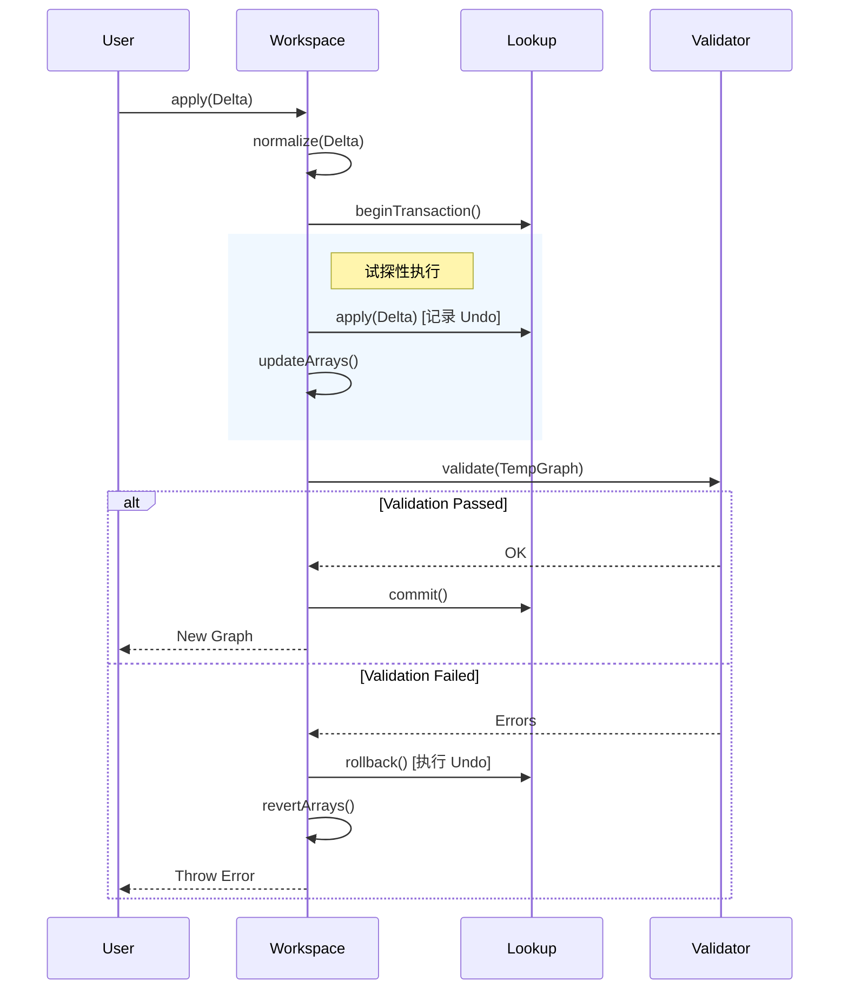

# Graph 引擎架构分析与设计方案

## 1. 概述

`@opencode/graph` 是一个高性能、可扩展的内存图（Graph）引擎，专为支持复杂的图编辑场景（如流程编排、数据血缘分析、可视化建模）而设计。

它采用了**微内核架构**，将核心数据模型（Model）、索引查询（Lookup）、编辑会话（Workspace）与校验逻辑（Validate）解耦，实现了高内聚低耦合的设计目标。

## 2. 核心架构原则

1.  **Graph 是唯一权威真相源**
    *   Graph (`nodes`/`edges` 数组) 表示“事实”。
    *   索引（Lookup）是派生结构，永远可以从 Graph 全量重建。

2.  **所有变更必须经过事务（Transaction）**
    *   不再允许直接 mutate Workspace 状态。
    *   `apply` 操作即为提交事务。
    *   **事务流程**：Begin -> Mutate -> Validate -> Commit/Rollback。

3.  **索引是可回滚的缓存**
    *   `IncrementalLookup` 支持 `beginTransaction`, `commit`, `rollback`。
    *   内置 Undo 栈，自动记录反向操作（Reverse Delta）。

4.  **命令（Intent）与补丁（Patch）分离**
    *   命令表达用户意图（如“连接两个节点”）。
    *   Patch (`GraphDelta`) 表达事实变更（如“addedEdges: [...]”）。

5.  **计算层纯函数化**
    *   校验 (`validate`)、影响分析 (`affectedSubgraph`) 等逻辑不依赖 Workspace 内部状态，仅依赖传入的 Graph 接口。

## 3. 模块详细设计

### 3.1 模型层 (`src/model`)

定义了图的基础数据结构，完全贫血模型。

*   **Graph**: 图的根对象，包含节点列表、边列表和索引引用。
*   **Node/Edge**: 核心实体。
    *   **ID 生成**: 采用 `nanoid` (16位) 生成唯一 ID，支持语义前缀 (如 `node-`, `edge-`)。
    *   **Endpoint**: `Input`/`Output` 统一继承自 `Endpoint`，具备独立 ID。

### 3.2 索引层 (`src/lookup`)

*   **Lookup (Immutable)**: 只读索引，用于 `Graph` 实例。
*   **IncrementalLookup (Mutable)**: 可变索引，用于 `GraphWorkspace`。
    *   **事务支持**: 维护 `transactionStack`，记录每步操作的反向 Delta。
    *   **回滚机制**: 发生错误时，逆序执行 Undo 栈恢复索引状态。

### 3.3 工作区层 (`src/workspace`)

*   **GraphWorkspace**: 用户交互的主要入口。
    *   **事务性 Apply**:
        1.  **Normalize**: 规范化 Delta。
        2.  **Prepare**: 计算针对数组的反向 Delta。
        3.  **Transaction**: 开启索引事务。
        4.  **Mutate**: 更新索引和数组。
        5.  **Validate**: 基于临时快照执行纯函数校验。
        6.  **Commit/Rollback**: 校验通过则提交，失败则全量回滚。

### 3.4 变更层 (`src/delta`)

*   **GraphDelta**: 变更描述对象。
*   **invertDelta**: 工具函数，用于根据当前图状态生成撤销变更（Undo Delta）。

## 4. 数据流转图 (事务流程)

## 5. 演进记录

### 5.1 近期重构 (已完成)
*   **事务机制**: 全面引入 ACID 事务，确保 Graph 状态强一致性。
*   **ID 生成**: 统一使用 `src/utils/id` 生成带前缀的短 ID。
*   **代码规范**:
    *   `GraphDefinition` 重命名为 `Base`。
    *   `Edge` 属性重命名为 `source/target`。
    *   `IncrementalLookup` 修复了 TS 类型错误。

### 5.2 下一步计划
1.  **测试覆盖**: 补充针对事务回滚的单元测试（目前仅有手动验证脚本）。
2.  **事件机制**: 引入 EventEmitter，允许外部订阅 `onCommit`, `onRollback` 事件。
3.  **高级校验**: 增加环路检测（Cycle Detection）规则。
